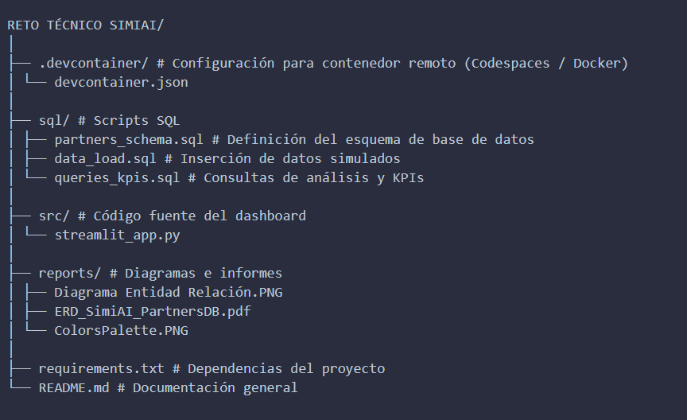

# 🚀 Sistema de Partners — SimiAI

**Autor:** Fernando Raúl Robles  
**Tecnologías:** Python | Streamlit | PostgreSQL | Plotly | Pandas  
**Base de datos:** Neon.tech (PostgreSQL Cloud)  
**Dashboard Online:** 👉 [Ver aplicación en Streamlit Cloud](https://dashboard-simiai.streamlit.app/)

---

## 🧠 Descripción General

El **Sistema de Partners — SimiAI** es un módulo analítico diseñado para centralizar, monitorear y visualizar información sobre los **partners comerciales** de una organización.

El sistema integra datos de países, planes, estados y notificaciones, generando **KPIs interactivos** mediante un **dashboard en Streamlit**, conectado a una base de datos **PostgreSQL en la nube (Neon.tech)**.

---

## 🧩 Objetivos del Proyecto

- Centralizar la información de partners y sus relaciones.
- Evaluar desempeño comercial mediante **KPIs y métricas interactivas**.
- Analizar la distribución geográfica y la evolución temporal de altas.
- Visualizar actividad y engagement de los partners mediante **notificaciones**.
- Analizar distribución geográfica, evolución temporal y engagement.  
- Detectar oportunidades de expansión a partir de los datos filtrados.  
- Proveer un resumen automático con **insights generados dinámicamente**.

---

## 🏗️ Arquitectura del Sistema

El proyecto está compuesto por tres capas principales:

### 🔹 1. Capa de Datos (PostgreSQL / Neon.tech)
- Tablas: `countries`, `plans`, `statuses`, `partners`, `notifications`
- Relaciones establecidas mediante claves foráneas (3NF)
- Conexión administrada con reconexión automática (`db_connection.py`)

### 🔹 2. Capa de Análisis (Python + Pandas)
- Limpieza, merge y transformación de datos.  
- Cálculo de KPIs: actividad, crecimiento, engagement, antigüedad, etc.  
- Categorización temporal y detección de tendencias mensuales.

### 🔹 3. Capa de Visualización (Streamlit + Plotly)
- Filtros combinables por país, plan y fecha.  
- Visualizaciones interactivas en **modo oscuro**.  
- Generación de *insights ejecutivos* adaptados a los filtros aplicados.
---

## 📊 Diagrama Entidad–Relación

 Ver: 


> El modelo relacional respeta la normalización 3NF, garantizando integridad referencial y consistencia de los datos.

---

## 📁 Estructura del Proyecto

 Ver: 


---

## ⚙️ Configuración del Entorno

### 🧩 Requisitos Previos

- Python 3.11+
- PostgreSQL (o una cuenta en [Neon.tech](https://neon.tech))
- Git y Visual Studio Code  
  

---

### 🚀 Instalación y Ejecución Local

```bash
# 1️⃣ Clonar el repositorio
git clone https://github.com/ferroblesmdq12/simiai-ds-tech-challenge.git

# 2️⃣ Entrar al directorio del proyecto
cd simiai-ds-tech-challenge

# 3️⃣ Instalar dependencias
pip install -r requirements.txt

# 4️⃣ Ejecutar el dashboard de Streamlit
streamlit run src/streamlit_app.py

# 
###  Análisis de Datos 

ver archivo PDF: 

---
### 📊 Análisis de Datos y KPIs

KPI	Descripción
Total y Estado de Partners	Muestra el total y proporción de partners activos vs inactivos.
Evolución de Altas Mensuales	Representa la tendencia temporal de nuevas altas.
Distribución Geográfica	Indica la cantidad de partners por país en gráfico horizontal y mapa.
Partners Activos por Plan	Permite analizar el desempeño comercial por tipo de plan.
Distribución por Industria	Identifica los sectores con mayor presencia.
Top 10 Partners por Notificaciones	Mide el nivel de interacción más alto dentro de la red.
Tasa de Crecimiento Mensual (%)	Indica la variación porcentual entre meses consecutivos.
Antigüedad Promedio (meses)	Calcula la media de tiempo desde el alta de cada partner.
País con Más Altas Recientes	Identifica el país más activo en el último período.
Correlación Antigüedad–Notificaciones	Muestra la relación entre experiencia del partner y actividad.
🧠 Insights Clave (Automáticos)

El sistema genera insights en lenguaje natural a partir de los datos filtrados:

La red cuenta con 240 partners, de los cuales 82.5% están activos.

El mercado con mayor presencia es México, con 65 partners.

El ritmo de altas mensuales muestra una tendencia de alza 📈 (Δ +50%).

El plan con mayor adopción es Premium.

La industria más representada es Tecnología.

Se detectan oportunidades de expansión en Chile, Perú y Uruguay.

Este módulo resume automáticamente la situación actual del negocio sin intervención manual.

--- 

### Vsisualizaciones 

🗺️ Visualizaciones


🌎 Mapa Coroplético: partners por país (América completa).

📈 Línea de tendencia: altas mensuales.

🥧 Gráfico de torta: estado activo vs inactivo.

🏭 Barras: distribución por industria y plan.

📊 Dispersión: correlación entre antigüedad y engagement.


---

###🎨 Paleta de Colores

La paleta azul se diseñó para optimizar la visualización en modo oscuro y mantener coherencia con el estilo del dashboard.

---

### 🧱 Dev Container (Entorno Reproducible)

El archivo devcontainer.json
 configura un entorno reproducible basado en Python 3.11 (Bookworm).
Al abrir el proyecto en VS Code o GitHub Codespaces:

Instala automáticamente todas las dependencias (requirements.txt)

Ejecuta el comando streamlit run src/streamlit_app.py

Abre los archivos principales (README.md, streamlit_app.py)

Expone el puerto 8501 con vista previa del dashboard

Esto garantiza que el proyecto funcione igual en cualquier entorno local o remoto 

---


## 👨‍💻 Autor

Fernando Raúl Robles

📊 Data Analyst | Python | SQL | Power BI | BigQuery | Google Cloud | Visualization | KPIs | ETL | AI Automation | n8n | Streamlit | Neon 

🌐 Portfolio Web: https://ferroblesmdq12.github.io/myprofile/?lang=en

💼 LinkedIn: https://www.linkedin.com/in/fernando-ra%C3%BAl-robles-bbb214223/

📧 fernando.robles.mdq@gmail.com